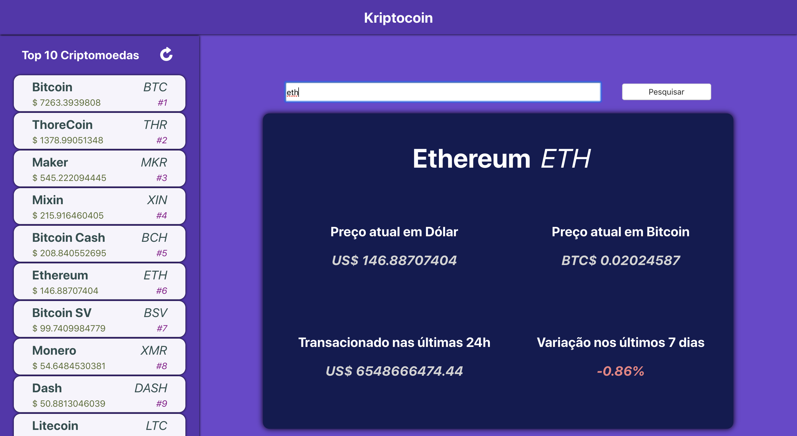

# Kriptcoin
See informations of a cryptocurrency

## Overview
The project consists of two parts, a python server using the fastapi framework and a client application implemented with react framework. The cryptocurrency information used by server is requested from [CoinMarketCap API](https://api.coinmarketcap.com/v1/ticker).

<p align="center">
    
</p>

## Requirements
- Docker Compose
- pytest (To run backend tests)

## How to run
Clone the project and execute docker-compose command:
```sh
docker-compose up
```
Open browser on [http://localhost:8081](http://localhost:8081)

## How to run backend tests
Enter `backend` folder and run command:
```sh
pytest
```

